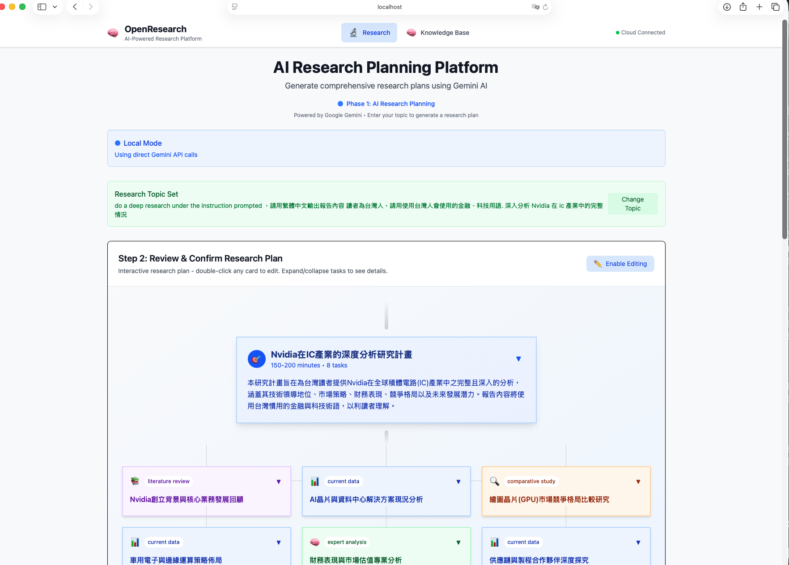

## Github: 免費 AI 研究助理!大學生寫報告必備神器 OpenResearch

期末報告要分析產業趨勢,光是找資料就花了 3 天?求職準備想了解目標公司,卻不知道從哪開始?

其實有個免費工具,能幫你一鍵生成專業的產業研究報告。它叫 **OpenResearch**。就像幫你請了一個 AI 研究助理,自動搜尋整理資料,還會產出完整報告。

今天就來介紹這個大學生必備的神器 ✨


<figure align="center">
  
  <figcaption>圖 1：OpenResearch 工具主介面（輸入主題即可生成研究報告）</figcaption>
</figure>

<!-- 如果需要第二張圖並排 -->
<div align="center" style="margin: 15px 0;">
  
</div>
<p align="center">圖 2：AI 自動生成的產業研究報告頁面 1 </p>

<div align="center" style="margin: 15px 0;">
  
</div>
<p align="center">圖 3：AI 自動生成的產業研究報告頁面 2 </p>

<div align="center" style="margin: 15px 0;">
  
</div>
<p align="center">圖 4：AI 自動生成的產業研究報告頁面 3 </p>

<div align="center" style="margin: 15px 0;">
  
</div>
<p align="center">圖 5：AI 自動生成的產業研究報告頁面 5 </p>


## [看看AI生成的報果結果](https://goooolai.zeabur.app/nvidia.html) 


## OpenResearch 是什麼?

**一句話說明**:OpenResearch 是開源的 AI 研究工具。它用 Google Gemini AI 自動搜尋產業資料,幫你生成專業研究報告。

想想看,你在寫期末報告的「產業分析」章節。以前你要:
1. Google 搜尋一堆關鍵字
2. 開 20 個分頁慢慢看
3. 整理筆記、寫成報告
4. 花掉整個週末

現在用 OpenResearch:
1. 輸入你想研究的主題
2. 按下按鈕,等 5-10 分鐘
3. 拿到一份完整的研究報告
4. 省下大半時間 ⏰

**為什麼大學生應該認識這個工具?**

因為它能處理最花時間的部分 —— **資料搜尋和初步整理**。

你還是要讀報告、加入自己的觀點、調整內容。但至少不用從零開始。你是站在 AI 幫你整理好的基礎上繼續。
這樣能省下不少時間,把精力放在更重要的分析和思考上。

而且它完全免費(在 Google 給的免費額度內)。

## 三種應用情境

### 情境一:期末報告的產業分析章節 📚

**場景**:你修了一門「行銷管理」課,期末報告要分析「台灣手搖飲市場」。

**痛點**:要寫市場規模、競爭態勢、發展趨勢,光是找資料就頭大。

**用 OpenResearch 怎麼做?**
1. 輸入主題:「台灣手搖飲市場分析 2024-2025」
2. AI 會自動搜尋新聞、產業報告、市場數據
3. 生成一份包含市場規模、主要品牌、競爭分析的報告
4. 你再根據課程要求,加入自己的分析和建議

**實際上**:原本可能要花好幾小時的資料搜尋,現在 1 小時內搞定。你有更多時間思考「這個市場有什麼機會?我的建議是什麼?」


### 情境二:求職準備的公司研究 💼

**場景**:你想應徵某家新創公司的實習,面試前想深入了解這家公司。

**痛點**:要研究公司背景、產業定位、競爭對手,資訊很分散。

**用 OpenResearch 怎麼做?**
1. 輸入公司名稱和產業:「[公司名稱] + 台灣 AI 新創產業分析」
2. AI 幫你整理公司新聞、產業趨勢、競品資訊
3. 你快速了解公司定位和產業背景
4. 面試時能問出有深度的問題

**實際上**:準備面試更有信心。你也能在自我介紹時 show 出「我有做功課」的積極態度。HR 會印象深刻 🌟

### 情境三:社團創業的市場調查 🚀

**場景**:你的社團想辦「校園二手市集」,需要做可行性分析。

**痛點**:要了解校園二手市場、類似活動案例、潛在挑戰,不知道怎麼下手。

**用 OpenResearch 怎麼做?**
1. 輸入:「大學校園二手市集 + 市場分析 + 成功案例」
2. AI 整理其他學校的經驗、市場需求、可能問題
3. 你得到一份完整的背景研究
4. 根據報告調整活動企劃

**實際上**:提案給學校時,有數據和案例支持,說服力更強。成功率提高不少 📈

## 快速上手指南

**Step 1:準備工作**
- 需要有 Node.js(去官網下載安裝,免費的)
- 申請 Google AI Studio API Key(免費額度夠用)
- Mac/Linux 用戶可直接使用,Windows 用戶需要 WSL

**Step 2:安裝 OpenResearch**
```bash
# 下載專案
git clone https://github.com/dmquant/OpenResearch

# 安裝套件
npm install

# 啟動工具
npm run dev
```

**Step 3:開始使用**
1. 打開瀏覽器,會看到 GUI 介面
2. 輸入你想研究的主題
3. 按下開始,等待 AI 生成報告
4. 下載報告,開始你的創作

**老實說**:安裝過程需要一點技術背景。如果你完全沒碰過程式,可能要花 30 分鐘到 1 小時摸索。但 GUI 介面蠻友善的,跟著步驟做不會太難 💪

## 結尾

OpenResearch 不會幫你「寫完」報告,但能幫你省下最花時間的資料搜尋階段。

對大學生來說,時間就是最珍貴的資源。你可以花 1 小時用工具生成初稿,把剩下的時間拿去深入思考、加入自己的觀點。不用像以前那樣,花 8 小時找資料找到頭昏。

這才是 AI 工具的真正價值 —— 讓你把時間花在更重要的事情上 🎯

**想試試看嗎?**
- GitHub 專案:https://github.com/dmquant/OpenResearch
- 安裝教學:專案的 README 有詳細步驟
