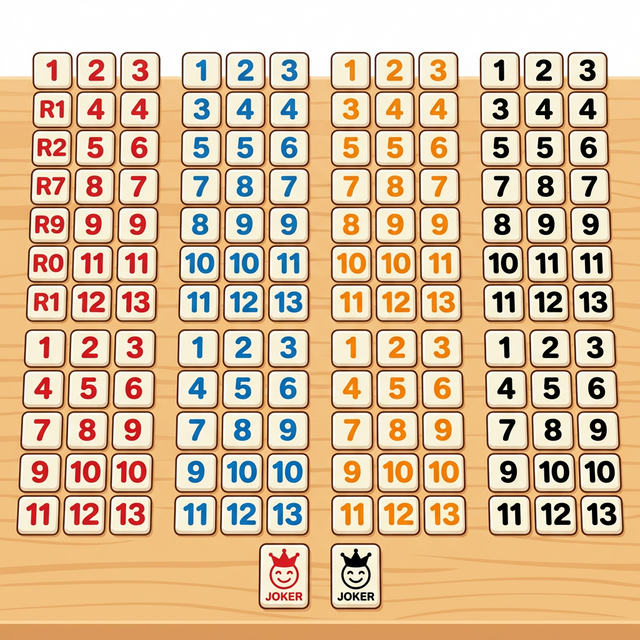
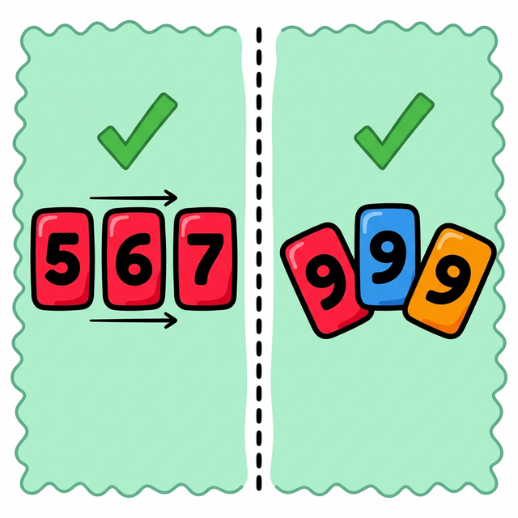
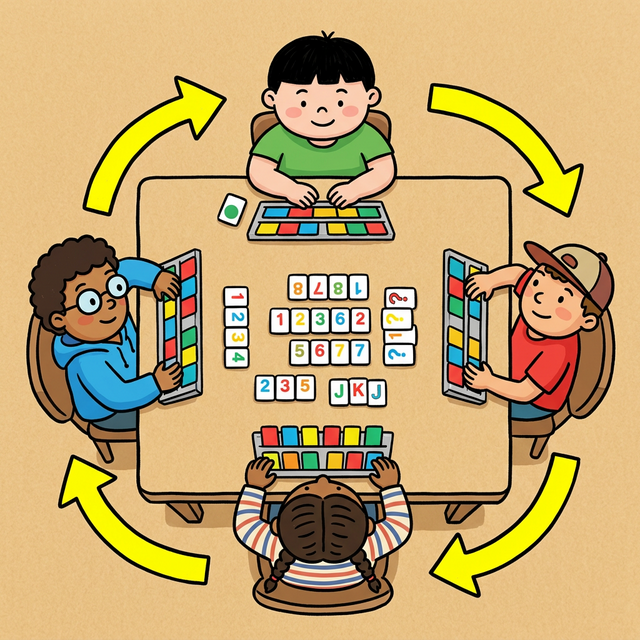
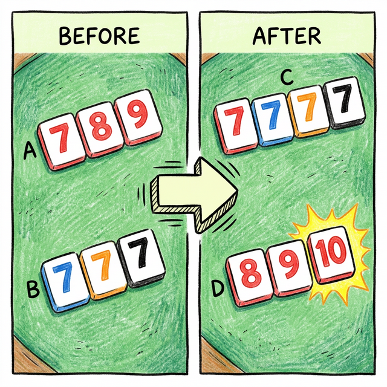
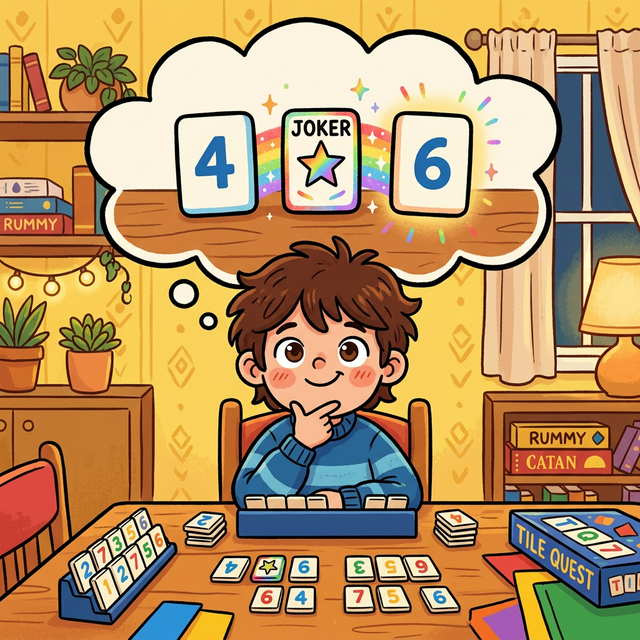
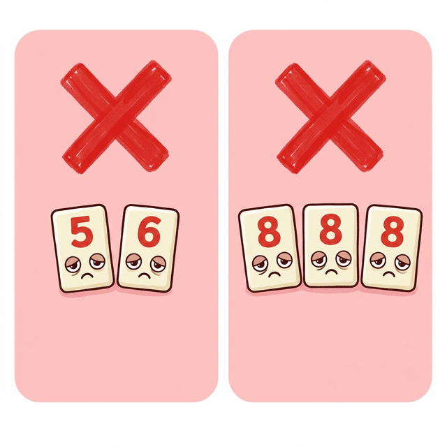
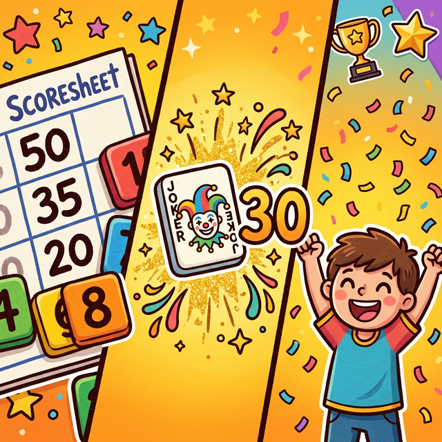

## 超詳細圖解拉密(Rummikub)規則

有一天在誠品逛到一款叫做拉密（Rummikub）的桌遊，上網查了一下，
玩法類似台灣的麻將——用數字牌組合出合法牌組，先出完牌的人獲勝。
家裡妹妹很喜歡玩桌遊，但網路上的規則說明都寫得很複雜，小學生很難看懂。
幫她整理了一份完整拉密玩法圖解，從牌組介紹到得分計算，全部一目瞭然。

---

### 🎮 拉密是什麼？

拉密（Rummikub）是一款源自以色列的數字桌遊，全球銷量超過 5000 萬套，適合 2～4 人同樂，8 歲以上皆可上手。

  

拉密牌組：4 色（紅、藍、橙、黑）× 數字 1–13，每色兩組，共 106 張牌（含 2 張百搭牌）

---

### 🃏 兩種合法牌組

拉密的核心就是組合「合法牌組」，只有兩種：

**同色連號（順子）**：同一顏色、連續數字，至少 3 張
**同號異色（刻子）**：同一數字、不同顏色，3 到 4 張

  

左：順子（同色連號）；右：刻子（同號異色）

---

### 🎯 遊戲流程

每位玩家從牌袋抽 14 張牌開始，輪流出牌或補牌，第一次出牌需要達到 **30 分門檻**。

  

遊戲流程：抽牌 → 組牌 → 出牌（或補抽一張）→ 下一位玩家

---

### ♻️ 重新排列桌面

拉密最有趣的地方：你可以**重新排列桌上所有已出的牌**，借用別人的牌來幫自己出牌！

  

善用重新排列，把桌上的牌拆解重組，讓自己出更多牌

---

### 💡 進階策略

  

掌握百搭牌、觀察對手手牌數量、控制節奏是取勝關鍵

---

### ❌ 常見錯誤

  

新手最容易犯的錯：刻子中同色重複、順子不連續、忘記補回完整組合

---

### 🏆 計分方式

  

先出完手牌獲勝；其他玩家手中剩餘牌面值加總，計為輸家扣分（百搭牌 -30 分）

